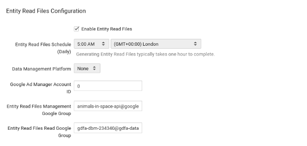

# Setting Up Orchestra
Orchestra is a tool for managing Display and Video 360(DV360) ETL tasks like downloading ERFs and uploading them to BigQuery.

## Before starting 
You will need:
* a GCP account
* a DV360 Account

## Outline of Walkthrough
This walkthrough covers:
1. setting up a project with billing
2. Enabling the relevant GCP APIs for Orchestra
3. Setting up Composer (can take around 30 minutes)
4. Creating a service account
5. Create a new user for your service account in DV360
6. Configuring Orchestra
7. Adding worflow DAGs

<walkthrough-author name="Peter Lafferty">
</walkthrough-author>

<walkthrough-duration duration="45">
</walkthrough-duration>

## Project Setup
Select or create project with billing to use for this walkthrough:
<walkthrough-project-billing-setup>
</walkthrough-project-billing-setup>

Read more about [setting up billing](https://cloud.google.com/billing/docs/how-to/manage-billing-account) in the GCP documentation.

## Enable APIs for {{project-name}}
<walkthrough-enable-apis apis="storage-component.googleapis.com,bigquery-json.googleapis.com,composer.googleapis.com,dataproc.googleapis.com">
</walkthrough-enable-apis>


## Create a Composer environment
This can take up to 30 minutes. The environment should be set to use Python 2.


Choose the LOCATION and the ENVIRONMENT_NAME for the composer environment. 


ENVIRONMENT_NAME must match the: `^[a-z](?:[-0-9a-z]{0,62}[0-9a-z])?$`


This command will set up the composer environment and use the default service account.

``` bash
  gcloud composer environments create --python-version 2 --location LOCATION ENVIRONMENT_NAME
```
Read more about [setting up composer](https://cloud.google.com/composer/docs/how-to/managing/creating) in the GCP documentaiton.
## Service Account
A service account will be used to grant access to GCP from DV360.

For simplicity you can use the `Compute Engine default service account`. Run the following command to see the service accounts:

``` bash
gcloud iam service-accounts list --project={{project-name}}
```
Read more about [service accounts](https://cloud.google.com/iam/docs/service-accounts) in the GCP documentation.
## Display and Video 360 Setup
Using the service account's email address [create a new user in DV360](https://support.google.com/displayvideo/answer/2723011?hl=en).

### Account Configuration
Give the new user the following:
* the email address of the service account
* select all the advertisers to access
* Give the user Read and Write permissions

### Entity Read File Authorization
The service account needs access to the Entity Read Files in DV360. 

Access to the ERFs is granted through a Google Group. The name of the google group can be found in DV360

**Settings > Basic Details > Entity Read Files Configuration  > Entity Read Files Read Google Group**

Add the service account to the Entity Read Files **Read** Google Group.



### Multiple Partners
If you are intending to use many google groups, it is also possible to set up a single Google Group containing all other Google Groups. You can then Add the Service account to this Google Group to grant access to all accounts at once

## Orchestra Configuration Variables

Set the `gce_zone` you can find the zone in your list of composer environments:
``` bash
 gcloud --project {{project_id}} composer environments run [COMPOSER ENVIRONMENT] --location [LOCATION] variables -- --set gce_zone [ZONE]
```

Next link a bucket. You can view your buckets with:
``` bash
gsutil ls -p {{project_id}}
```

Set a configuration variable `gcs_bucket` for the bucket name without the `gs://` prefix:
``` bash
 gcloud --project {{project_id}} beta composer environments run [COMPOSER ENVIRONMENT] --location [LOCATION] variables -- --set gcs_bucket [BUCKET NAME]
```

Set the project id:
``` bash
 gcloud --project {{project_id}} beta composer environments run [COMPOSER ENVIRONMENT] --location [LOCATION] variables -- --set cloud_project_id {{project_id}}
```

Create a BigQuery dataseet and assign the name to `erf_bq_dataset`:
``` bash
gcloud --project {{project_id}} beta composer environments run [COMPOSER ENVIRONMENT] --location [LOCATION] variables -- --set erf_bg_dataset [dataset name]
```

Set the ``partner_ids`` separated by commas:
``` bash
gcloud --project {{project_id}} beta composer environments run [COMPOSER ENVIRONMENT] --location [LOCATION] variables -- --set partner_ids [partner ids]
```

Set the [Private ERF tables](https://developers.google.com/bid-manager/guides/entity-read/format-v2#private-tables) that you would like to import with `private_entity_types`. Separated by commas:
``` bash
gcloud --project {{project_id}} beta composer environments run [COMPOSER ENVIRONMENT] --location [LOCATION] variables -- --set private_entity_types [entity types]
```

Set a name for your dag as it will show in the UI with `sequential_erf_dag_name`:
``` bash
gcloud --project {{project_id}} beta composer environments run [COMPOSER ENVIRONMENT] --location [LOCATION] variables -- --set sequential_erf_dag_name [any name]
```


## Adding Workflow DAGs
## Final Step
<walkthrough-conclusion-trophy></walkthrough-conclusion-trophy>
